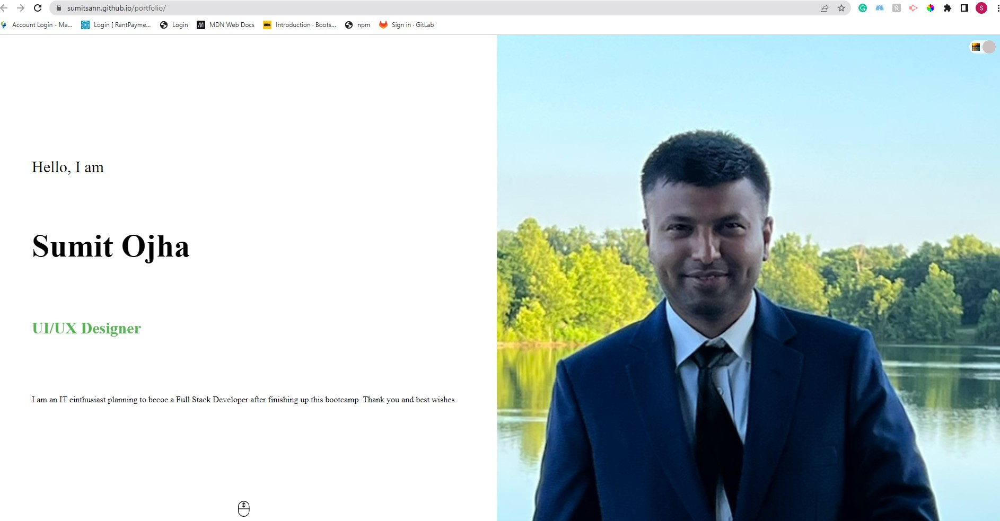
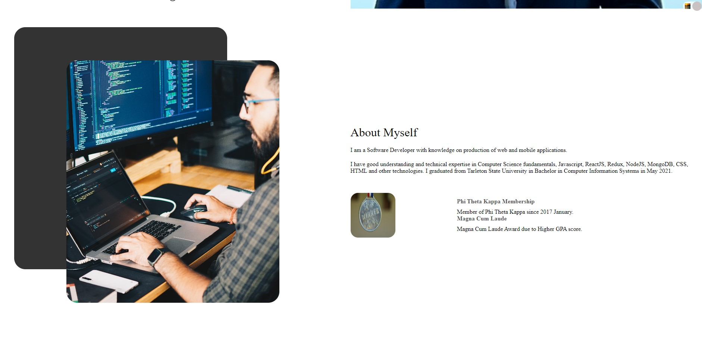
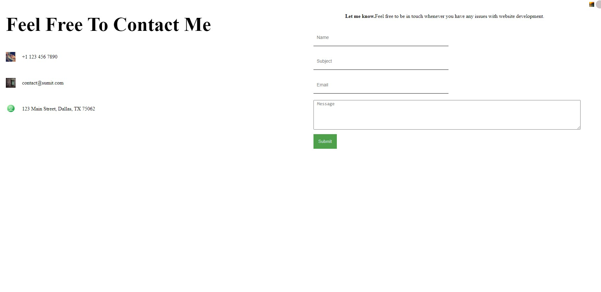

# React JS Portfolio App

## Description

Responsive Application that uses React JS to display the Portfolio of the Works done by me.

## Table of contents

- [Installation](#Installation)
- [Usage](#Usage)
- [Contribution](#Contribution)
- [Questions](#Questions)
- [Screenshots](#Screenshots)
- [URL](#URL)

## Installation

- npm i

## Usage

- npm start

## Contribution

Sumit Ojha

## Questions

- sumit.ojha.dev@gmail.com
- https://github.com/sumitsann

## Screenshots

## URL

https://sumitsann.github.io/portfolio/
